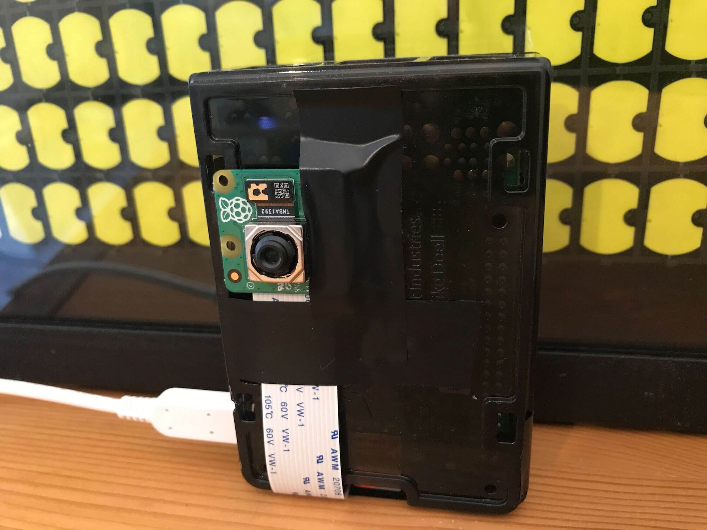

# Experiments with Redis and the Raspberry Pi Camera Module

## Overview 

This repository contains an example application that demonstrates how to capture images from a Raspberry Pi using the camera module, store them in [Redis Hashes](https://redis.io/docs/data-types/hashes/) and render them in a web application.  

The project started by using an older Raspberry Pi camera module and the Redis `SCAN` command to retrieve all of the data and present it in the front end.  [Release v0.0.1](https://github.com/simonprickett/redis-pi-camera/releases/tag/v0.0.1) has that code.

I enhanced the code to use the newer Raspberry Pi camera module with autofocus and also added configurable image expiry time in Redis and capture of Lux values from the camera.  Check out [release v0.0.2](https://github.com/simonprickett/redis-pi-camera/releases/tag/v0.0.2) for that.

In my second live stream for this project, I replaced the `SCAN` command with the [Search capability of Redis Stack](https://redis.io/docs/stack/search/).  [Release 0.0.3](https://github.com/simonprickett/redis-pi-camera/releases/tag/v0.0.3) contains the code from that stream.

Here's what the front end looks like when a few images have been captured by the Raspberry Pi...


And here's a Raspberry Pi with a camera attached:



## Watch the Videos

Watch the first video for a full walkthrough of this project.  [Watch on YouTube](https://www.youtube.com/watch?v=OTDZIK55DX0).

In the second episode I started to use Redis Stack's Search capability.  [Watch on YouTube](https://www.youtube.com/watch?v=mcGL6Lk2IXU).

I'm planning a third episode once I can figure out what to do in it :)

## Components of the Demo

This repository contains two components:

* **[Image capture component](pi/):** This is written in Python and runs on a Raspberry Pi with a camera module attached.  It takes a new picture every so often and stores it, plus some basic metadata, in Redis.  Python was the obvious implementation choice here as Raspberry Pi provides an excellent Python library for their camera modules. See the `pi` folder for full details.
* **[Front end component](server/):** This comprises a server written in Python using the Flask framework.  It reads data from Redis and uses a HTML front end to display it in a grid view.  It uses HTML, JavaScript and the Bulma framework.  These were all arbitrary choices - this component could equally be built with Node.js and Express for example.  See the `server` folder for full details.

Details of how each component works including how to configure and run it can be found in the README files in each of the above folders.

## Redis

Both components need to be connected to the same Redis Stack instance to talk to each other. 

If you want to use Docker, start Redis Stack like this:

```
docker-compose up -d
```

When you're done with the Docker container, stop it like this:

```
docker-compose down
```

Your data is saved in a [Redis Append Only File](https://redis.io/docs/management/persistence/) in the `redisdata` folder.  Redis Stack will reload the dataset from this file when you restart the container.

With the container running, you can access the [Redis CLI](https://redis.io/docs/ui/cli/) using this command:

```
docker exec -it redispiimages redis-cli
```

See the RedisInsight section of this document if you're interested in a graphical alternative to the Redis CLI interface.

You'll need to make sure that both components of the application can connect to your Redis instance.  See details in each component's README.

This project will also work with a free Redis Stack cloud instance from Redis (the company).  To use this, [sign up here](https://redis.com/try-free/) and make a note of your Redis host, port and password.  You'll need those to configure each component.  When using the free cloud instance, note that you get 30Mb space which will fill up with images quickly.  You can manage this by setting a shorter image expiry time in the capture component's configuration.

## The Redis Data Model, Key Naming Strategy and Indexing

### Data Type and Key Naming Strategy

The application stores each image plus associated metadata in its own [Redis Hash](https://redis.io/docs/data-types/hashes/).  A Hash in Redis can be thought of as a flat map of name/value properties.  Each Hash is stored in its own key in Redis.

The key naming strategy is as follows.  Each Hash's key has a fixed prefix `image:` followed by the [UNIX timestamp](https://en.wikipedia.org/wiki/Unix_time) representing the time that the image was captured.

For example the key `image:1681844748` would contain a Hash with data for an image taken on Tuesday 18th April 2023 at 7:05:48pm GMT.

Each key contains a hash with the following name/value pairs:

* `mime_type`: The [MIME type](https://en.wikipedia.org/wiki/Media_type) for the captured image data.  This will always be `image/jpeg` unless you change it and the image capture format in the `capture.py` script.
* `timestamp`: The [UNIX timestamp](https://en.wikipedia.org/wiki/Unix_time) that the image was captured at, as recoded from the Raspberry Pi's clock.  This will be the same value as the timestamp in the key name.
* `lux`: The [lux](https://en.wikipedia.org/wiki/Lux) value captured by the camera when the image was taken.
* `image_data`: A binary representation of the bytes for the image captured by the camera.  This will be a [JPEG image](https://en.wikipedia.org/wiki/JPEG) unless you change the capture format in `capture.py`.

Here's a complete example, with the image data truncated for brevity:

```
> HGETALL image:1681843615
1) "mime_type"
2) "image/jpeg"
3) "timestamp"
4) "lux"
5) "268"
6) "1681843615"
7) "image_data"
8) "\xff\xd8\xff\xe0\x00\x10JFIF\x00\x01\x01\x00\x00...
```
With the camera that I used ([Raspberry Pi Camera Module 3](https://www.raspberrypi.com/products/camera-module-3/) capturing at 4608x2592 pixels - configurable in `capture.py`) you can expect each Hash to require around 1Mb of RAM in Redis.

### Indexing and Querying

As we saw in the initial live stream video, using `SCAN` allows us to retrieve all of the keys containing image data for display in the front end.  This has a couple of problems:

* We can't do any meaningful filtering or searching on the server side in Redis.
* `SCAN` is effectively a O(n) time complexity command, so the bigger the dataset the longer it's going to take / the more load it will put on the Redis server.

The Search capability of Redis Stack addresses both of these and gives us a flexible way to index and query our data.  To use it, we first have to create and index with the [`FT.CREATE` command](https://redis.io/commands/ft.create/).  Once created, Redis Stack will monitor changes to keys that match the index criteria and update the index automatically.  We can then write rich queries using the `FT.SEARCH` command.

Here's our index creation command - you'll need to paste this into Redis CLI or RedisInsight and execute it before running the front end:

```
FT.CREATE idx:images ON HASH PREFIX 1 image: SCHEMA mime_type TAG lux NUMERIC SORTABLE timestamp NUMERIC SORTABLE
```

This command creates an index on keys in Redis whose key names begin `image:` and which are of type `HASH`.  Where found, the values of fields named `timestamp` and `lux` are indexed as numeric values and the values of fields named `mime_type` are indexed as tags (exact match string values).

Here are some example queries that we can run against this index.

Find the 9 most recent images (most recent first), returning their timestamp, MIME type and lux values:

```
FT.SEARCH idx:images "*" RETURN 3 timestamp mime_type lux SORTBY timestamp DESC LIMIT 0 9
```

Truncated example response:

```
1) "12"
2) "image:1684427475"
3) 1) "timestamp"
   2) "1684427475"
   3) "mime_type"
   4) "image/jpeg"
   5) "lux"
   6) "85"
4) "image:1684427251"
5) 1) "timestamp"
   2) "1684427251"
   3) "mime_type"
   4) "image/jpeg"
   5) "lux"
   6) "104"
6) "image:1684427190"
7) 1) "timestamp"
   2) "1684427190"
   3) "mime_type"
   4) "image/jpeg"
   5) "lux"
   6) "109"
8) "image:1684427130"
9) 1) "timestamp"
   2) "1684427130"
   3) "mime_type"
   4) "image/jpeg"
   5) "lux"
   6) "93"
...
```

Find the 9 most recent images with lux value between 100 and 120, again with the most recent image first:

```
FT.SEARCH idx:images "@lux:[100 120]" RETURN 3 timestamp mime_type lux SORTBY timestamp DESC LIMIT 0 9
```

For more information on how to write search queries, check out:

* [Search query syntax documentation](https://redis.io/docs/stack/search/reference/query_syntax/).
* [RU203 - Querying, Indexing and Full-Text Search](https://university.redis.com/courses/ru203/): A free course at Redis University.

## (Optional, but Recommended): RedisInsight

RedisInsight is a free graphical management and database browsing tool for Redis. You don't need it to look at how the application stores data in Redis (you can use redis-cli if you prefer) but I'd recommend it as it's much easier to get an overall picture of the state of the database with a graphical tool.  RedisInsight runs as a desktop application on your Mac, Windows or Linux machine.

[Download RedisInsight here](https://redis.io/docs/ui/insight/).

If you're using the Docker compose file provided with this project to run Redis Stack, you can also access a web based version of RedisInsight with no additional software to install.  With the Docker container running, navigate to `http://localhost:8001` to use the web version.
